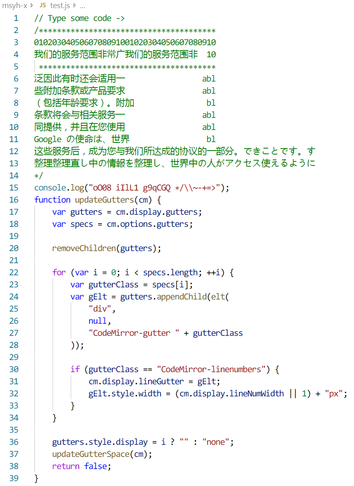

# msyh-x: font for programing based on microsoft yahei and consola

专为程序员制作的等宽字体。基于微软雅黑和consola。

最近想寻找一个新的更好的编程字体，发现很多字体英文虽然做得很好，但是因为只有英文，导致中日文等的显示很不理想。选来选去最后还是自己以前制作并一直使用的msyh-x效果相对来说是最好的。

使用时不同字号的显示效果有轻微差别，请自行调节至合适字号。

测试文件test.js的显示效果如下

